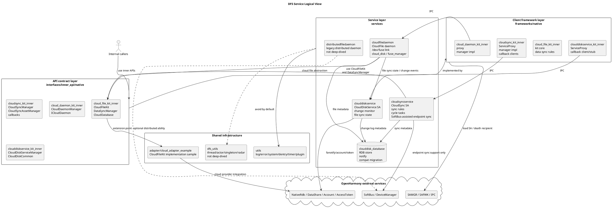

# DFS Service 逻辑视图

本仓整体是 OpenHarmony C++/GN 工程，核心分层如下：

```text
interfaces/inner_api/native
  -> frameworks/native
    -> services/*
      -> utils, adapter, external_deps
```



`interfaces/inner_api/native/` 定义稳定的内部 API、IPC broker、callback、Parcelable 和接口码。外部模块应该通过这里暴露的 manager/kit/callback 类型进入，而不是直接依赖服务实现。

`frameworks/native/` 是客户端侧封装层。它负责加载 System Ability、持有 proxy、处理死亡通知、封装 callback stub/client，并为上层提供更直接的 C++ manager/kit 调用。

`services/` 是服务实现层。`cloudsyncservice` 提供 CloudSync SA，`cloudfiledaemon` 提供 daemon 与 `/dev/fuse` 建链及云盘/云图 FUSE 能力，`clouddiskservice` 提供三方网盘变更监听和文件同步状态能力，`clouddisk_database` 提供 RDB、通知、同步辅助和历史兼容迁移支持。

`utils/` 是当前知识库会使用的公共基础设施，常见能力包括日志、错误码、账号/权限辅助、路径/目录工具、RAII fd/memory guard、dentry/metafile、异步 work、timer、plugin loader。`dfs_utils/` 属于分布式文件相关底层工具，当前知识库不深挖，默认不作为改动范围。

`adapter/cloud_adapter_example/` 是云侧能力的适配示例。它实现 `CloudFileKit` 抽象族，服务层通过接口依赖它，而不是把云厂商实现写进核心服务；当前知识库仅把它作为示例和契约校验入口，不深入维护具体云厂商实现。
